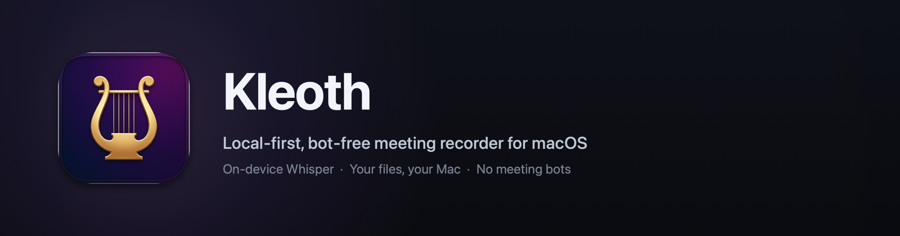
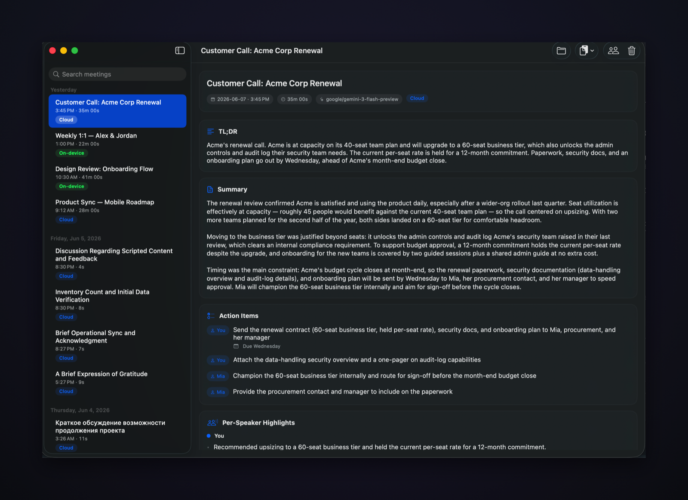
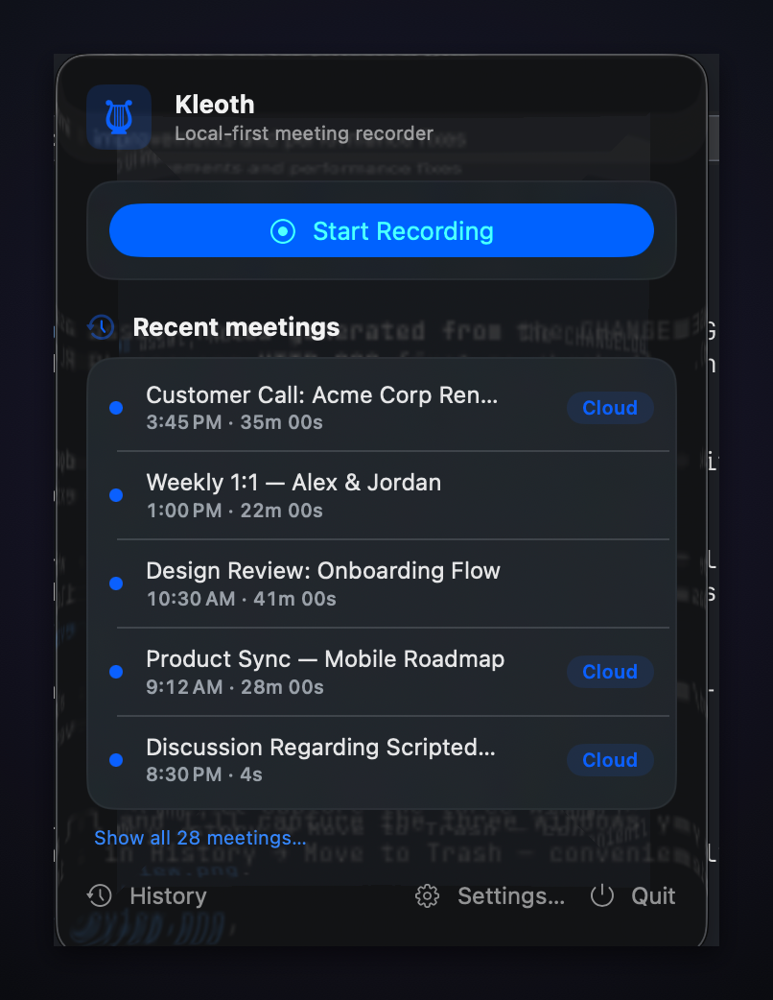

# Kleoth

<p align="center">
  
</p>

[](https://github.com/ofcRS/kleoth/releases/latest)
[](https://github.com/ofcRS/kleoth/releases)
[](https://www.apple.com/macos/)
[](https://www.swift.org/)
[](LICENSE)

**A local-first, bot-free meeting recorder for macOS.** Kleoth captures your microphone and the
other participants' system audio directly on your Mac, transcribes it **on-device** with Whisper,
and writes plain Markdown/JSON files you own. No bot ever joins your call. Nothing leaves your
machine unless you explicitly ask it to.

> *kleos* (Greek κλέος) — "that which is heard." From the Proto-Indo-European root \*ḱlew‑, "to hear."

Kleoth is an open-source alternative to hosted meeting recorders (tl;dv, Fireflies, Otter). Instead
of inviting a bot into your call and uploading everything to a SaaS, it records both sides locally
and keeps the transcript and summary as files in `~/Kleoth`.

- **Free & private by default** — transcription runs on the Apple Neural Engine via
  [WhisperKit](https://github.com/argmaxinc/WhisperKit). No account, no API key, no upload.
- **Multilingual, automatic** — Whisper auto-detects the spoken language (English, Russian, and
  dozens more). You can also pin a language in Settings.
- **You vs. Them, for free** — your mic and the system audio are recorded as separate channels, so
  speaker separation ("You" / "Them") is exact, with no diarization guesswork.
- **Optional cloud upgrade, per meeting** — one click sends a meeting to
  [ElevenLabs Scribe](https://elevenlabs.io) for state-of-the-art transcription, using *your* key.
- **Optional AI summaries** — TL;DR, overview, action items, and per-speaker highlights via
  [OpenRouter](https://openrouter.ai) (any model), using *your* key. The summary is written in the
  meeting's own language.
- **Your data, your files** — every meeting is a folder of audio + `transcript.md` + `summary.md` +
  JSON in `~/Kleoth`. Grep it, sync it, delete it. There is no database and no lock-in.

## Requirements

- **macOS 14.4 or later.** Apple Silicon recommended (the on-device model runs on the Neural Engine).
- **~600 MB one-time download** for the Whisper model on first transcription, then fully offline.
- API keys are **optional** — only needed for the cloud transcription and AI-summary features.

## Screenshots

<p align="center">
  <br>
  <em>The History window — searchable, day-grouped meetings with a TL;DR, summary, action items, and per-speaker highlights.</em>
</p>

<p align="center">
  <br>
  <em>The menu-bar popover — start a recording and reach recent meetings.</em>
</p>

<!-- TODO: screenshot — first-run onboarding (Settings → Show Welcome Window) -->

## Install

**[⬇ Download Kleoth-0.1.0.dmg](https://github.com/ofcRS/kleoth/releases/download/v0.1.0/Kleoth-0.1.0.dmg)**
(7.8 MB · [SHA-256](https://github.com/ofcRS/kleoth/releases/download/v0.1.0/Kleoth-0.1.0.dmg.sha256))
— or browse all [Releases](../../releases).

Open the DMG and drag **Kleoth.app** onto the **Applications** folder. Kleoth lives in the menu bar
(the lyre icon).

### First launch (current builds are self-signed)

Until Kleoth ships notarized builds, macOS Gatekeeper will warn that it is from an unidentified
developer. This is expected — the app is signed, just not yet with an Apple-issued Developer ID.

1. In **Applications**, **right-click Kleoth.app → Open** (don't double-click the first time).
2. In the dialog, click **Open** again. macOS remembers the choice; subsequent launches are normal.

This step exists only because notarization requires an Apple Developer Program membership (planned —
see [Roadmap](#roadmap)). The build is otherwise complete and signed.

<!-- Once notarized + a Homebrew tap exists:
```sh
brew install --cask kleoth
```
-->

## Permissions Kleoth requests, and why

| Permission | Why | When |
| --- | --- | --- |
| **Microphone** | Record your side of the conversation. | First recording. |
| **System Audio Recording** | Record the other participants (the audio your Mac plays). Shown under *Privacy & Security → Screen & System Audio Recording*. | First recording. |
| **Keychain** | Store your optional API keys securely. **Click "Always Allow"** so you are not re-prompted. | When you save a key, or on a re-signed build. |
| Calendar *(optional)* | Name a meeting from the calendar event you're in. Decline freely. | If you grant it. |

Everything except the microphone and system-audio grants is optional. Kleoth never uploads audio
unless you trigger the cloud transcription action yourself.

## Quick start

1. Open Kleoth from the menu bar and click **Start Recording** (or use the global hotkey).
2. Have your meeting. The menu-bar icon shows you're recording.
3. Click **Stop**. The recording moves into your meeting list and transcribes in the background
   on-device — you can start another recording immediately.
4. When it finishes, open the meeting to read the transcript and (if you've added an OpenRouter key)
   the summary. The same content is on disk at `~/Kleoth/meeting-<timestamp>/` as `transcript.md` and
   `summary.md`.

That's it — no key required for steps 1–4.

## Configuration

Open **Settings** from the menu bar. Everything here is optional:

- **ElevenLabs API key** — enables the per-meeting **"Fully transcribe"** (Cloud) action. The key
  needs the `speech_to_text` permission.
- **OpenRouter API key** — enables AI summaries. Note: if your OpenRouter account blocks providers
  that may train on your data, choose a no-train model (e.g. `google/*`, `deepseek/*`,
  `meta-llama/*`); the default `google/gemini-3-flash-preview` works out of the box.
- **Summary model** — any OpenRouter model slug. Default: `google/gemini-3-flash-preview`.
- **Transcription language** — *Auto* (detect per meeting) or pin a specific language.

Keys are stored in the macOS Keychain and are **never** printed or committed.

## CLI

The repo also ships a `kleoth` command-line tool for the same pipeline (audio file → transcript →
summary → Markdown), independent of the app:

```sh
swift run kleoth transcribe meeting.m4a   # ElevenLabs Scribe; diarized; saves the meeting
swift run kleoth summarize  <dir|file>    # transcribe (if needed) + AI summary  (--model <slug>)
swift run kleoth rename     <dir>         # assign real names to speaker_0 / speaker_1 …
swift run kleoth render     <dir>         # re-render summary.md from summary.json (no API calls)
```

Run `swift run kleoth <subcommand> --help` for flags. The CLI resolves keys from environment
variables (`ELEVEN_API_KEY`, `OPENROUTER_API_KEY`), a local `.env`, or
`~/.config/kleoth/config.json`.

> **Free summaries in Claude Code:** the `summarize-meeting` project skill produces the same
> `summary.json` / `summary.md` using your Claude Code session — no OpenRouter key, zero API cost.
> Just ask it to summarize a meeting folder.

## Integrations

- **Raycast extension** — `integrations/raycast-extension/`. Toggle/Start/Stop Recording, Search
  Meetings (open/copy summary, transcript, and paths), and Latest Summary. Import with
  `npm install && npm run dev` in that directory.
- **Shortcuts / App Intents** — Start/Stop/Toggle recording as app intents (see
  `app/Sources/KleothApp`). Note: SwiftPM builds don't run Apple's App Intents metadata extractor, so
  intents may not auto-surface in Spotlight; the URL scheme and hotkey work regardless.
- **`kleoth://` URL scheme** — `kleoth://record`, `kleoth://stop`, `kleoth://toggle`,
  `kleoth://summarize-latest`. Callable from `open`, scripts, Raycast, etc.
- **Global hotkey** — bind a system-wide shortcut for toggle-recording in Settings.

## Data & privacy

By default, **nothing leaves your machine.** Transcription is on-device; summaries and cloud
transcription only run when you opt in with your own keys.

Each meeting is one self-contained folder, `~/Kleoth/meeting-yyyy-MM-dd-HHmmss/`:

```
mic.m4a · system.m4a · meeting.m4a   # your audio (mic, system, 2-channel combined)
transcript.json · transcript.md       # the transcript (raw + rendered)
summary.json   · summary.md           # the AI summary (if generated)
speakers.json                         # speaker_0 / speaker_1 → display names (You / Them)
meta.json                             # metadata: duration, tier, timestamps, consent
```

**Consent:** recording conversations is regulated and the rules vary by jurisdiction — many places
require **all-party consent**. Kleoth records both sides without a visible bot; that is a UX choice,
**not legal cover**. Get every participant's consent before recording. The app surfaces a consent
acknowledgement and stamps it into each meeting's `meta.json`.

## Build from source

```sh
# Core library + CLI (deployment target macOS 13)
swift build && swift test                  # builds; runs the unit suite

# Menu-bar app (deployment target macOS 14.4)
swift build --package-path app             # compile-check the app + capture packages
bash app/setup-signing.sh                  # one-time: create the local "Kleoth Self-Signed" cert
bash app/make-app.sh release               # bundle, sign, install to /Applications

# Package a distributable DMG (self-signed tier)
bash app/make-dmg.sh                        # → app/dist/Kleoth-<version>.dmg (prints SHA-256)
```

The release process (version bump, the notarized public tier, tagging, `gh release`) is documented
in [`docs/RELEASING.md`](docs/RELEASING.md).

## Architecture

Two SwiftPM packages. **Package 1** (repo root, macOS 13) is `KleothCore` — models, networking
seam, transcription (ElevenLabs Scribe client + the engine-agnostic `Transcriber` protocol),
summarization (OpenRouter client), rendering, speaker mapping, storage, and the meeting pipeline —
plus the `kleoth` CLI. **Package 2** (`app/`, macOS 14.4) is the `KleothApp` SwiftUI menu-bar agent
and `KleothCapture` (Core Audio process-tap for system audio, AVAudioEngine for the mic, and the
`LocalTranscriber` built on WhisperKit). The only non-Apple core dependency is
`swift-argument-parser`; the app adds WhisperKit and KeyboardShortcuts.

## Roadmap

- **Notarized builds** — Gatekeeper-clean install (needs Apple Developer Program enrollment). The
  signing/notarization pipeline is already wired in `app/make-dmg.sh`, pending the certificate.
- **Homebrew cask** — `brew install --cask kleoth` once releases are notarized.
- **Sparkle auto-update.**
- **Whisper model-size picker** — trade accuracy for speed/size.
- A default-engine toggle (on-device vs. cloud) and live captions are under consideration.

## License

[Apache License 2.0](LICENSE), except the Raycast extension
(`integrations/raycast-extension/`), which is MIT-licensed — the Raycast Store requires MIT for
published extensions.

## Acknowledgments

- [WhisperKit](https://github.com/argmaxinc/WhisperKit) (Argmax) — on-device Whisper inference on
  Core ML / the Apple Neural Engine.
- [KeyboardShortcuts](https://github.com/sindresorhus/KeyboardShortcuts) (Sindre Sorhus) — the
  global hotkey.
- [ElevenLabs Scribe](https://elevenlabs.io) — optional cloud speech-to-text.
- [OpenRouter](https://openrouter.ai) — optional AI summaries across many models.
