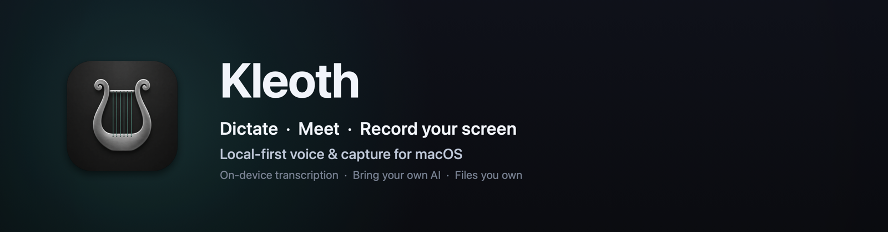
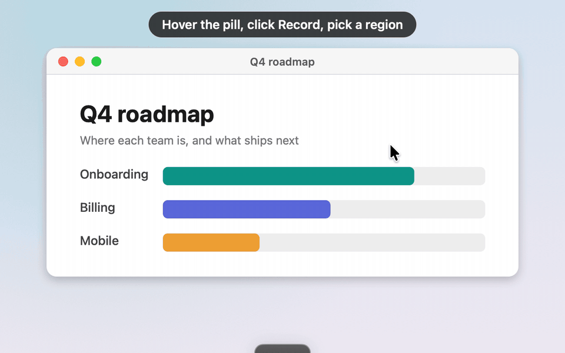
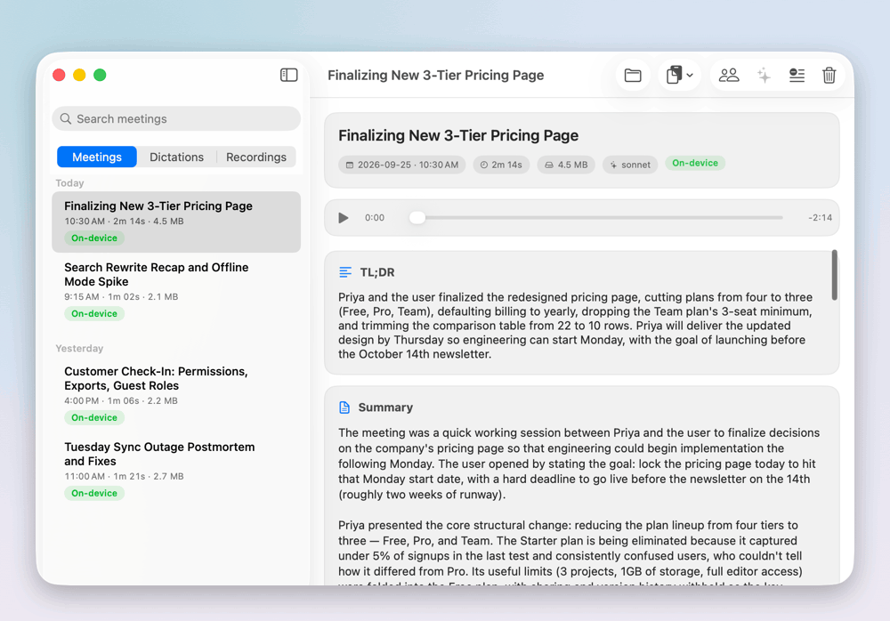
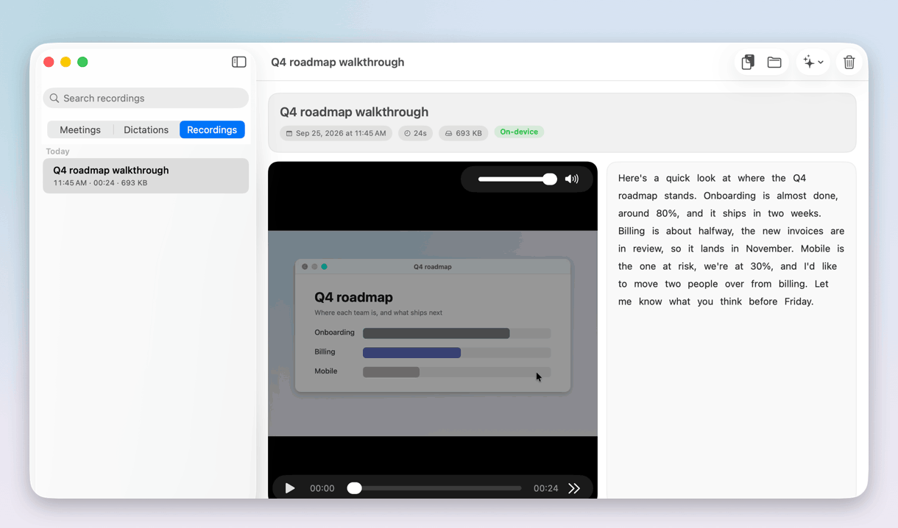
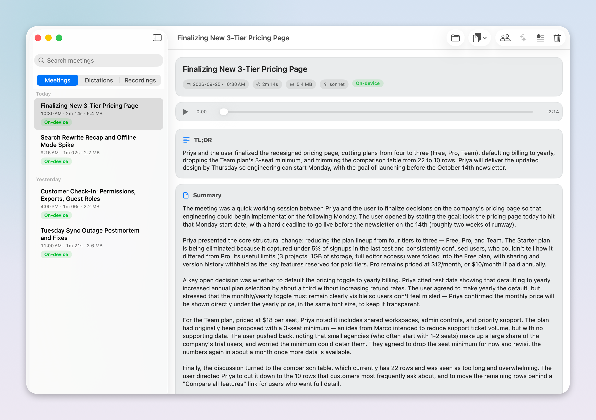
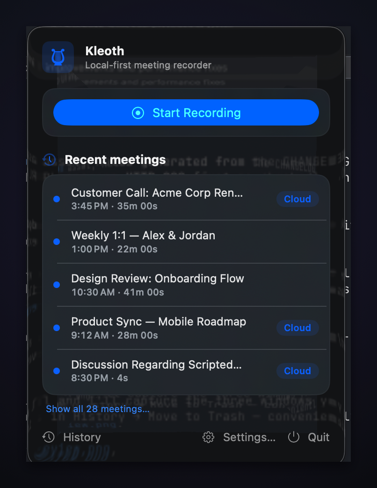

# Kleoth

<!-- positioning:start — generated from marketing/positioning.json by `bun marketing/sync.ts apply`; edit the JSON, not this block -->
<p align="center">
  
</p>

[](https://github.com/ofcRS/kleoth/releases/latest)
[](https://github.com/ofcRS/kleoth/releases)
[](https://www.apple.com/macos/)
[](https://www.swift.org/)
[](LICENSE)

**Local-first voice, meetings and screen capture for macOS.**

Kleoth is an open-source Mac app for **system-wide dictation**, **bot-free meeting recording** and **screen recording with transcripts**. What it records and transcribes are plain files in `~/Kleoth` that you own; transcription can stay on your Mac, and the AI steps run on whatever you already use.

- **[Dictate anywhere](docs/dictation.md).** Hold fn+shift, speak, let go: cleaned-up text lands in whatever app has focus — an editor, a terminal, an AI chat, mail. Wispr Flow-style voice typing with a personal dictionary and a searchable history. Speech-to-text runs on ElevenLabs Scribe with your own key.
- **[Record meetings without a bot](docs/meetings.md).** Your mic and the call's audio (Zoom, Meet, Teams, anything that plays sound), recorded on your Mac with nobody joining the call. Transcribed on device with Whisper, summarized in the meeting's own language, saved as Markdown and JSON. A local, open-source alternative to Granola, and a bot-free one to Otter, Fireflies and tl;dv.
- **[Record your screen](docs/screen-recording.md) (beta).** A display or a region, with system audio and your mic, as a small MP4. Transcribed on device afterwards; the viewer highlights each word as it is spoken. Loom-style, but nothing is uploaded. No trimming, sharing or export yet.

**Bring your own AI — or none.** Summaries and dictation clean-up run on whatever you already use: Claude Code, Codex, a local Ollama or LM Studio server, OpenRouter, or Apple's on-device model. Kleoth doesn't sell you another AI subscription. [Which providers, and what each needs →](docs/ai-providers.md)

No account. No database. Local-first by design.
<!-- positioning:end -->

> *kleos* (Greek κλέος) — "that which is heard." From the Proto-Indo-European root \*ḱlew‑, "to hear."

<p align="center">
  
  
</p>

## Dictation: Wispr Flow-style voice typing in any app

Hold **fn+shift**, speak, let go: Kleoth transcribes what you said, cleans it up with one short
language-model pass (fillers and false starts gone, never translated) and pastes it into whatever
app has focus. If you know Wispr Flow or Superwhisper, it is the same hold-to-talk idea. Double-tap
for hands-free, or tap ⌘ (or click the pill) when a hold runs long. It fits the text already there:
speak a correction over a selection and the two come back as one piece in its place (one ⌘Z undoes
it); at the cursor, your words continue the sentence. In an editor, an AI chat or a terminal, a long spoken ramble comes back as the text you
would have typed — paragraphs, a list where you listed things; a quick chat message is pasted as
heard. A personal dictionary biases recognition toward your names and jargon, and every dictation
lands in a searchable history.

Speech-to-text runs on [ElevenLabs Scribe](https://elevenlabs.io) with your own key; the clean-up
runs on your AI provider. [More about dictation →](docs/dictation.md)

## Meetings: a local alternative to Granola, a bot-free one to Otter, Fireflies and tl;dv

Kleoth records your microphone and the call's audio directly on your Mac — Zoom, Google Meet,
Teams, a browser tab, anything that plays sound. No bot joins the call, and the audio stays on
your Mac unless you choose cloud transcription.

- **Transcribed on device** by Whisper ([WhisperKit](https://github.com/argmaxinc/WhisperKit) on the
  Apple Neural Engine). No account, no API key. The language is detected automatically — English,
  Russian and dozens more — or pinned in Settings.
- **You vs. Them, exactly** — your mic and the system audio are separate channels, so who said what
  needs no diarization guesswork.
- **Cloud transcription when it matters** — one click sends a meeting to ElevenLabs Scribe, with
  your key; the on-device version is kept alongside.
- **Summaries in the meeting's language** — TL;DR, overview, action items and per-speaker
  highlights, written after each transcription by your AI provider (on Automatic, the first one
  Kleoth finds — see [Bring your own AI](#bring-your-own-ai)).
- **Files, not a database** — every meeting is a folder of audio, `transcript.md`, `summary.md` and
  JSON in `~/Kleoth`. Grep it, sync it, delete it.

<p align="center">
  
</p>

[More about meetings →](docs/meetings.md)

## Screen recording: Loom-style, local (beta)

Pick "Record screen…" in the menu-bar popover (or hover the pill, shown while dictation is on, and click **Screen**), drag
a region or take the whole display, and Kleoth records it with system audio **and** your microphone as one small H.264 MP4 (about 22 MB
per minute) in `~/Kleoth/screen-recordings/`. Each recording is transcribed on device afterwards
and opens in a viewer with the transcript beside the video: the spoken word is highlighted, clicking
a word seeks, double-clicking corrects it. It is a beta — no trimming, sharing or export yet.
[More about screen recording →](docs/screen-recording.md)

<p align="center">
  
</p>

## Bring your own AI

Kleoth doesn't sell you another AI subscription. Summaries and dictation clean-up need a language
model, and Kleoth uses whatever you already have, in this order, unless you pick one in
Settings → Accounts:

| Provider | What it needs | Summaries | Dictation |
|---|---|---|---|
| Local server (Ollama, LM Studio, any OpenAI-compatible URL) | the server running, default `http://localhost:11434/v1` | ✓ | ✓ |
| Claude Code | the `claude` CLI installed and signed in | ✓ | ✓ (slow — several seconds per cleanup) |
| Codex | the `codex` CLI installed and signed in | ✓ | — |
| OpenRouter | an API key | ✓ | ✓ |
| Apple on-device | macOS 26 with Apple Intelligence on | — | ✓ |

Speech-to-text is separate from all of these: Whisper runs on device for meetings and screen
recordings, and [ElevenLabs Scribe](https://elevenlabs.io), with your key, transcribes dictation
and anything you send to the cloud. More in [docs/ai-providers.md](docs/ai-providers.md),
including the one Ollama setting long meetings need. Only OpenRouter and Claude Code also get the
text you're dictating into; a local server and Apple's model clean up your words alone.

Nothing is sent anywhere you did not sign up for: the CLIs run as the binaries you installed,
with their own login; the local server and Apple's model never leave the machine.

**If Kleoth is useful to you, starring the repo helps other Mac users find it.** ⭐

## Requirements

- **macOS 14.4 or later.** Apple Silicon recommended (the on-device model runs on the Neural Engine).
- **~600 MB one-time download** for the Whisper model on first transcription, then fully offline.
- API keys are **optional**. An ElevenLabs key is needed for dictation and cloud transcription;
  summaries can run on a provider that needs no key at all (see [Bring your own AI](#bring-your-own-ai)).

## Screenshots

<p align="center">
  <br>
  <em>The History window — searchable, day-grouped meetings with a TL;DR, summary, action items, and per-speaker highlights.</em>
</p>

<p align="center">
  <br>
  <em>The menu-bar popover — start a recording and reach recent meetings.</em>
</p>

## Install

<!-- release:start — generated from app/bundle/Info.plist + app/dist by `bun marketing/sync.ts apply` -->
**[⬇ Download Kleoth-0.5.0.dmg](https://github.com/ofcRS/kleoth/releases/download/v0.5.0/Kleoth-0.5.0.dmg)**
(7.8 MB · [SHA-256](https://github.com/ofcRS/kleoth/releases/download/v0.5.0/Kleoth-0.5.0.dmg.sha256))
— or browse all [Releases](../../releases).
<!-- release:end -->

Open the DMG and drag **Kleoth.app** onto the **Applications** folder. Kleoth lives in the menu bar
(the lyre icon).

### First launch

Kleoth isn't notarized yet, so macOS blocks the first launch with a warning. Allow it once:

- **macOS 15 or later:** open Kleoth and click **Done** on the warning. Then go to **System Settings →
  Privacy & Security**, click **Open Anyway** next to Kleoth, and confirm.
- **macOS 14:** in **Applications**, right-click **Kleoth.app → Open**, then click **Open** in the
  dialog.

macOS remembers the choice.

## Permissions Kleoth requests, and why

| Permission | Why | When |
| --- | --- | --- |
| **Microphone** | Record your side of the conversation. | First recording. |
| **System Audio Recording** | Record the other participants (the audio your Mac plays). Shown under *Privacy & Security → Screen & System Audio Recording*. | First recording. |
| **Keychain** | Store your optional API keys securely. **Click "Always Allow"** so you are not re-prompted. | When you save a key, or on a re-signed build. |
| Calendar *(optional)* | Name a meeting from the calendar event you're in. Decline freely. | If you grant it. |
| Accessibility *(optional)* | Needed only for dictation: watch for the fn+shift chord system-wide, send the ⌘V that pastes the dictated text, and read the selection and the text around the cursor in the field you dictate into ([what is read](#data--privacy)). | When you turn dictation on in Settings. |
| Screen Recording *(optional)* | Needed only for screen recording: capture the display or region you picked. Kleoth's own pill and picker are never in the frame. | The first time you start a screen recording. |
| Call detection *(optional, off by default)* | No permission and no prompt. Which apps are using the microphone comes from Core Audio; no audio is read. With Accessibility or Screen Recording already allowed, Kleoth also reads the call window's title ([what is kept](#data--privacy)). | Never asked. It runs while **Offer to record calls** is on in Settings → Meetings, and during each meeting you record, to note where it happened. |

Everything except the microphone and system-audio grants is optional. The only place Kleoth sends
audio is ElevenLabs Scribe, with your key: each dictation, and a meeting or recording you choose to
transcribe in the cloud.

## Quick start

The first launch opens a short welcome window: your name, recording consent, microphone and
system-audio access, and the speech-model download. After that, Kleoth lives in the menu bar (the
lyre).

- **Record a meeting.** Click the lyre → **Start Recording**, hover the pill (shown while dictation is
  on) and click **Meeting**, or press your recording hotkey. With **Offer to record calls** on
  (Settings → Meetings, off by default), the pill also asks when Zoom, Teams, Google Meet or another
  app starts using the microphone; nothing is recorded until you click **Record**. However you
  started it, the pill shows the meeting bar while it records — elapsed time, a mic and a
  system-audio meter, and **Stop**; **Stop Recording** in the popover works too. Open the meeting
  and click **Transcribe** (free, on device), or turn on automatic transcription in Settings →
  Meetings. If an AI provider is available, the summary follows. Everything is also on disk in
  `~/Kleoth/meeting-<timestamp>/`.
- **Dictate.** Turn on dictation in Settings → Dictation, allow Accessibility, and add an
  ElevenLabs key in Settings → Accounts. Then hold **fn+shift** in any app, speak, and let go.
- **Record your screen.** Click the lyre → **Record screen…**, drag a region or press Return for
  the whole display, and click **Stop** in the pill's toolbar. The recording is transcribed on
  device and opens from History → Recordings.

Meetings and screen recordings need no API key.

## Settings

Open **Settings** from the menu bar. Everything in it is optional:

- **Meetings** — the on-device model, the transcription language (auto-detected, or pinned),
  automatic transcription after recording, the summary model, naming meetings after your
  calendar event, call detection (off by default) and the apps you've said never to offer for,
  and [meeting covers](#meeting-covers) (off by default).
- **Dictation** — hold-to-talk on or off, the clean-up model, whether short dictations and chat
  messages are cleaned up too, **Use the text you're dictating into** (on by default; see
  [Data & privacy](#data--privacy) for what is read and sent), your personal dictionary, and
  resetting the pill's position. Without an AI provider, the raw transcript is pasted as-is.
- **Screen Recording** — the Screen Recording permission, and ways to start a recording or open
  your recordings.
- **Microphone** — one input for meetings, dictation and screen recordings; Automatic follows the
  system input.
- **Accounts** — which AI provider runs summaries and clean-up (Automatic, or one you pick), a local
  server's URL, your ElevenLabs and OpenRouter keys, and usage. The ElevenLabs key needs the
  `speech_to_text` permission.
- **General** — the output folder (`~/Kleoth`), the start/stop recording hotkey, and the welcome
  window.

Keys are stored in the macOS Keychain.

### Meeting covers

Off by default. Turn covers on in Settings → Meetings → Covers and each summarized meeting gets a
picture across the top of its page — cute animals or everyday objects acting out what the meeting
was about, as Animation, Illustration, Sketch or Clay — and a thumbnail on its History row. Click
the picture to see it full size. Your AI provider first writes a one-sentence scene from the
meeting's title, TL;DR and the start of its overview — no names, quotes or transcript — and only
that scene goes to the image engine. A meeting that looks personal (health, performance, pay,
hiring, legal matters, family) gets no picture.

| Engine | What it needs | What leaves your Mac |
|---|---|---|
| Local server | Ollama with an image model pulled (default `x/flux2-klein`) | nothing |
| Codex | the `codex` CLI installed and signed in | the scene, to OpenAI over your ChatGPT login — about a minute per cover, within your plan's limits |
| OpenRouter | an API key | the scene — each cover is billed to your OpenRouter account |

The summary itself goes only to the provider that already summarized the transcript. Right-click the
cover on the meeting page (or use its `…` button) for **New Cover** or **Remove Cover**; a meeting without one has a
**Draw Cover** chip; select older meetings and choose **Draw Covers** to give them one.

## CLI

The repo also ships a `kleoth` command-line tool for the same pipeline (audio file → transcript →
summary → Markdown), independent of the app:

```sh
swift run kleoth transcribe meeting.m4a   # ElevenLabs Scribe; diarized; saves the meeting
swift run kleoth summarize  <dir|file>    # transcribe (if needed) + AI summary  (--provider, --model)
swift run kleoth rename     <dir>         # assign real names to speaker_0 / speaker_1 …
swift run kleoth render     <dir>         # re-render summary.md from summary.json (no API calls)
swift run kleoth illustrate <dir>...      # draw a cover for summarized meetings (--engine, --style, --dry-run)
```

`summarize` runs on the same providers as the app: `--provider claude-code`, `codex`, `local` or
`openrouter`. Run `swift run kleoth <subcommand> --help` for flags. The CLI resolves keys from
environment variables (`ELEVEN_API_KEY`, `OPENROUTER_API_KEY`), a local `.env`, or
`~/.config/kleoth/config.json`.

## Integrations

- **Raycast extension** — `integrations/raycast-extension/`. Toggle/Start/Stop Recording, Search
  Meetings (open/copy summary, transcript, and paths), and Latest Summary. Import with
  `npm install && npm run dev` in that directory.
- **`kleoth://` URL scheme** — `kleoth://record`, `kleoth://stop`, `kleoth://toggle`,
  `kleoth://summarize-latest`. Callable from `open`, scripts, Raycast, etc.
- **Global hotkey** — bind a system-wide shortcut to start and stop recording in Settings → General.

## Data & privacy

**Recording and on-device transcription never leave your Mac**, and nothing ever goes to a Kleoth
server — there isn't one. What does leave, and when:

- **Audio** goes only to ElevenLabs Scribe, with your key: each dictation, and a meeting or
  recording you choose to transcribe in the cloud.
- **Transcripts** go to your AI provider: a meeting's, for its summary, right after it is
  transcribed; a dictation's, for clean-up. On **Automatic** (the default) that is the first
  provider Kleoth finds — local server, Claude Code, Codex, OpenRouter, Apple — so with no local
  server running and the Claude Code or Codex CLI signed in, your transcripts go to Anthropic or
  OpenAI under your account.
  To keep them on your Mac, pick a local server (Ollama, LM Studio) or, for dictation, Apple's
  on-device model in Settings → Accounts (see [Bring your own AI](#bring-your-own-ai)).
- **Meeting covers** (off by default): a one-sentence scene written from the summary goes to the image
  engine you pick — to OpenAI through Codex, or to OpenRouter; a local server keeps it on your Mac. See
  [Meeting covers](#meeting-covers).
- **Call detection** (off by default) sends nothing anywhere. Kleoth notices which apps are using
  the microphone (Core Audio reports that; no audio is read) and, with Accessibility or Screen
  Recording already allowed, reads the titles of those apps' windows to tell a meeting tab from
  other sites. A title that names no meeting is only matched against, never saved or logged. With
  calendar access, the offer names the event on now. The same watch runs during every meeting you
  record, whether call detection is on or off, so the meeting's `meta.json` notes where it happened
  (below).

Each meeting is one self-contained folder, `~/Kleoth/meeting-yyyy-MM-dd-HHmmss/`:

```
mic.m4a · system.m4a · meeting.m4a   # your audio (mic, system, 2-channel combined)
transcript.json · transcript.md       # the transcript (raw + rendered)
summary.json   · summary.md           # the AI summary (if generated)
speakers.json                         # speaker_0 / speaker_1 → display names (You / Them)
meta.json                             # metadata: title, participants, timestamps, consent, tier, where it happened
cover.jpg · cover.json                # the meeting's cover and how it was drawn (if covers are on)
```

`meta.json` is written the moment a meeting stops, transcribed or not. It records where the meeting
happened: the app, the service (Zoom, Google Meet…), how you started the recording, how long the app
held the microphone, the calendar event (with calendar access), and a window title only when it
named a meeting ("Weekly sync - Google Meet"). A meeting recorded by an older version may have no
`meta.json` until it is transcribed.

Dictations are text: `~/Kleoth/dictations/<yyyy-MM-dd>.json` holds the raw and polished text, the
target app, language, and models per utterance; the audio clip is deleted as soon as it has been
transcribed. Only a dictation whose transcription failed or was stopped keeps its clip, in
`~/Kleoth/dictations/audio/`, until it is transcribed or deleted. The personal dictionary is a
plain JSON array at `~/.config/kleoth/dictionary.json`.

**Dictating into text that's already there.** While **Use the text you're dictating into** is on
(Settings → Dictation, on by default), Kleoth reads the one field you dictate into, so the cleanup
can fit it:

- **When you press fn+shift**, it only asks the app what kind of field has focus. Chrome-based
  browsers and Electron apps make their text readable only once asked, so asking early gives them
  the time you spend speaking.
- **When you release**, it reads the selection, and up to 1,500 characters before and 500 after
  the cursor or selection. Just before pasting, it checks that the selection hasn't changed; if it
  has, your words are pasted on their own, as heard.
- **Which selections merge:** up to 4,000 characters. A selection of 4,000 to 20,000 characters, or
  one the cleanup failed on, stays as it was with your words added after it; one that can't be
  read, or is longer, is replaced by your words as before (⌘Z brings it back).
- **What is sent, and to whom:** that text goes, with your words, only to the AI provider that
  already cleans them up, and only when that is OpenRouter or Claude Code. Dictation reads nothing
  else on screen: not other fields, not window titles.
- **Never read:** password fields, password managers (1Password, Bitwarden, Passwords, Keychain
  Access) and Kleoth's own windows.
- **In a terminal** (Terminal, iTerm2, Ghostty, Warp, kitty, Alacritty, WezTerm), only a selection
  is read, as a reference for spelling names and identifiers (an error message, a function name).
  It is never replaced: your words go to the terminal's input, as before.
- **What is kept:** a selection that was rewritten is kept with the dictation in History, so you can
  get it back once the app's own undo is gone. The text around the cursor is never stored.

Turn the setting off and Kleoth reads nothing from the field; the cleanup gets your words alone.

Screen recordings are plain files in `~/Kleoth/screen-recordings/`: `screen-<timestamp>.mp4` plus a
`screen-<timestamp>.json` sidecar holding the title and the word-timed transcript. Editing a word in
the viewer rewrites only the sidecar; the movie is never touched.

**Consent:** recording conversations is regulated and the rules vary by jurisdiction — many places
require **all-party consent**. Kleoth records both sides without a visible bot; that is a UX choice,
**not legal cover**. Get every participant's consent before recording. The app surfaces a consent
acknowledgement and stamps it into each meeting's `meta.json`. Call detection only asks: a
recording starts when you click **Record**, never by itself.

## Build from source

```sh
# Core library + CLI (deployment target macOS 13)
swift build && swift test                  # builds; runs the unit suite

# Menu-bar app (deployment target macOS 14.4)
swift build --package-path app             # compile-check the app + capture packages
bash app/setup-signing.sh                  # one-time: create the local "Kleoth Self-Signed" cert
bash app/make-app.sh release               # bundle, sign, install to /Applications

# Package a distributable DMG (self-signed tier)
bash app/make-dmg.sh                        # → app/dist/Kleoth-<version>.dmg (prints SHA-256)
```

The release process (version bump, the notarized public tier, tagging, `gh release`) is documented
in [`docs/RELEASING.md`](docs/RELEASING.md).

## Architecture

Two SwiftPM packages. **Package 1** (repo root, macOS 13) is `KleothCore` — models, networking
seam, transcription (ElevenLabs Scribe client + the engine-agnostic `Transcriber` protocol),
summaries and dictation clean-up behind one provider seam (OpenRouter, a local OpenAI-compatible
server, the Claude Code and Codex CLIs), rendering, speaker mapping, storage, and the meeting
pipeline — plus the `kleoth` CLI. **Package 2** (`app/`, macOS 14.4) is the `KleothApp` SwiftUI
menu-bar agent, the pill (`KleothPillUI`), and `KleothCapture` (Core Audio process tap for system
audio, AVAudioEngine for the mic, ScreenCaptureKit for screen recording, and the
`LocalTranscriber` built on WhisperKit). Apple's on-device model is an app-only provider. The only
non-Apple core dependency is `swift-argument-parser`; the app adds WhisperKit and
KeyboardShortcuts.

## Roadmap

- **Notarized builds** — a Gatekeeper-clean install, with no first-launch warning.
- **Homebrew cask** — `brew install --cask kleoth` once releases are notarized.
- **Sparkle auto-update.**
- **Whisper model-size picker** — trade accuracy for speed/size.
- A default-engine toggle (on-device vs. cloud) and live captions are under consideration.

## License

[Apache License 2.0](LICENSE), except the Raycast extension
(`integrations/raycast-extension/`), which is MIT-licensed — the Raycast Store requires MIT for
published extensions.

## Acknowledgments

- [WhisperKit](https://github.com/argmaxinc/WhisperKit) (Argmax) — on-device Whisper inference on
  Core ML / the Apple Neural Engine.
- [KeyboardShortcuts](https://github.com/sindresorhus/KeyboardShortcuts) (Sindre Sorhus) — the
  global hotkey.
- [ElevenLabs Scribe](https://elevenlabs.io) — optional cloud speech-to-text.
- [OpenRouter](https://openrouter.ai) — optional AI summaries across many models.
