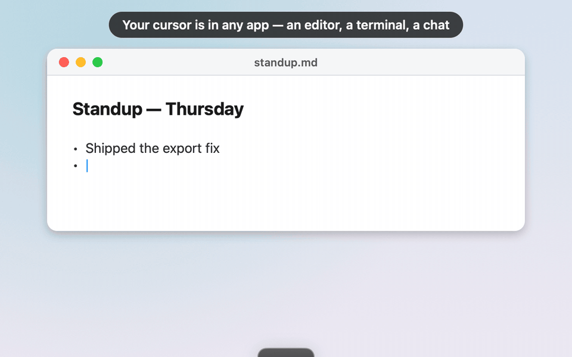

# Dictation on macOS: Wispr Flow-style voice typing in any app, open source

Kleoth's dictation turns speech into typed text in whatever Mac app has focus. Hold **fn+shift**,
speak, let go, and the cleaned-up text is pasted where your cursor is: an editor, a terminal running
Claude Code or Codex, ChatGPT in a browser, Slack, Mail. If you have used Wispr Flow or
Superwhisper, it is the same hold-to-talk idea. Kleoth is free and open source (Apache-2.0), has no account,
and keeps every dictation as plain JSON on your disk.

**[⬇ Download Kleoth](https://github.com/ofcRS/kleoth/releases/latest)** · macOS 14.4+ ·
[Back to the README](../README.md)

   
  <em>Kleoth's real pill, rendered with sample content.</em>

## How it works

1. **Hold fn+shift and speak.** A small dark pill at the edge of your screen springs out and shows a
   live waveform. Let go when you are done. Double-tap the chord for hands-free and tap once to
   stop; Esc cancels. You can also click **Dictate** on the pill's hover dock. From the next
   release, a hold that runs long can go hands-free mid-way: tap ⌘ while you hold, or click the
   pill, and let go of the keys. Nothing said so far is lost.
2. **Speech-to-text.** The clip goes to [ElevenLabs Scribe](https://elevenlabs.io) with your own
   API key. Your personal dictionary is sent along as key terms, so names and jargon come back
   spelled your way. Scribe gets a time budget that grows with the length of the clip, and a
   timeout or network error gets one automatic retry.
3. **Clean-up.** One short language-model pass removes fillers and false starts and keeps the word
   you settled on. It never translates: Russian stays Russian, including the English technical terms
   inside it. How much it restructures depends on where you are typing:
   - **Editors, AI chats, terminals, notes, mail, browsers:** a long spoken ramble comes back as the
     text you would have typed. Ideas are put in order, fragments merged, and anything you listed
     becomes a list. Every point is kept and nothing is invented.
   - **Messengers** (Slack, Telegram, Discord, Teams, WhatsApp, Messages, Linear) and anything
     shorter than 24 words are pasted as heard. That is about a second faster, with no model in the
     loop. A setting turns clean-up back on for these.
4. **Paste.** Kleoth pastes through the clipboard with a synthetic ⌘V and restores your previous
   clipboard half a second later.

The clean-up runs on whichever AI you already use: a local Ollama or LM Studio server, Claude Code,
OpenRouter, or Apple's on-device model on macOS 26. With none of them, the raw Scribe transcript is
pasted as it is. See [AI providers](ai-providers.md).

## When transcription fails (next release)

From the next release, a dictation that cannot be transcribed keeps its audio: Scribe timed out
twice, the network dropped, or the key was rejected. The pill says what happened ("Timed out —
saved to History") and offers **Retry**, which sends the same audio again and pastes the result.
Pressing Esc while it transcribes stops waiting and keeps the audio too ("Stopped — saved to
History"). Quitting Kleoth mid-transcription still discards it. In History, the row shows as
*Not transcribed*. There, **Try again in cloud** or
**Try again on device** (free, runs Whisper on this Mac) copies the text to your clipboard when
it's ready. Once a dictation is transcribed, its audio is deleted.

## History and dictionary

Every dictation is logged in `~/Kleoth/dictations/<yyyy-MM-dd>.json`: the raw and cleaned-up text,
the app it went to, the language and the models used. The **Dictations** tab of the History window
lets you browse and search it, and the pill menu can paste the last one again. The personal
dictionary is a plain JSON array at `~/.config/kleoth/dictionary.json`, editable in Settings →
Dictation. The first 100 terms are used.

## What leaves your Mac

- **To ElevenLabs Scribe, with your key:** the audio of each dictation and your dictionary terms.
- **To your clean-up provider** (on Automatic, the first one Kleoth finds): the transcript, the name of the app you are typing into,
  the detected language and your dictionary terms. If that provider is a local server or Apple's
  on-device model, nothing leaves the machine.
- Nothing goes to Kleoth: there is no Kleoth server.

## Set up

1. Install Kleoth ([latest release](https://github.com/ofcRS/kleoth/releases/latest)).
2. Settings → Dictation → turn dictation on and grant **Accessibility**. Kleoth needs it to watch
   for the fn+shift chord system-wide and to send the ⌘V that pastes.
3. Settings → Accounts → add an ElevenLabs API key with the `speech_to_text` permission.
4. Optional: pick an AI provider for the clean-up (Automatic finds one for you).

## Honest limits

- **Live dictation needs the internet and an ElevenLabs key.** Only the retry of a failed
  dictation can run on device today. If you need live dictation that never leaves the Mac, Kleoth
  is not that yet.
- The hotkey is fn+shift; it is not configurable yet.
- macOS only (14.4 or later).

## Related

- [Meetings](meetings.md): bot-free meeting recording and notes, from the same app.
- [Screen recording](screen-recording.md): Loom-style, local (beta).
- [AI providers](ai-providers.md): which models clean up your dictations and what each needs.

If Kleoth is useful to you, [starring the repo](https://github.com/ofcRS/kleoth) helps other Mac
users find it.
